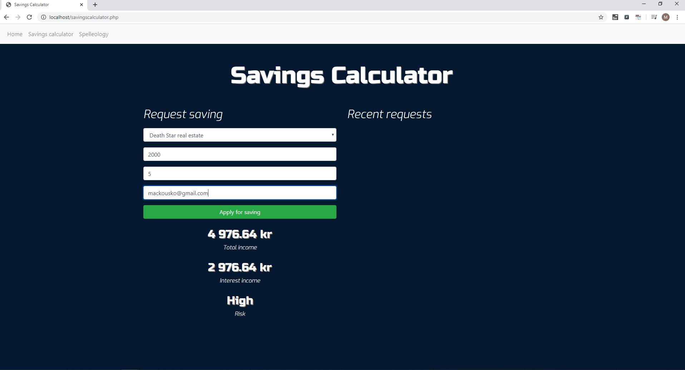
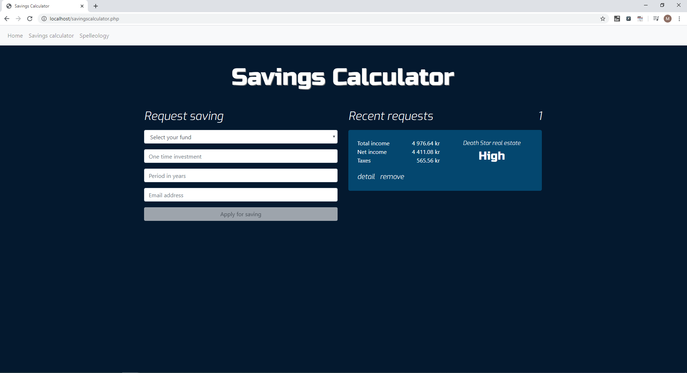

## Test Automation Course

This is my code related to Test Automation Course with Java, Selenium and JUnit.  
**Commits from 3 June 2019** represent my **Final Examination** (duration: 3 hours). The **tasks** in the examination were:  

1. Download page <https://github.com/skarbala/ta-mentor-program-playground> and launch it using MAMP.
2. You will test the page **Savings Calculator**.
3. For testing, use the same project we used throughout the whole course.
4. **Automate** following scenarios:

     a) Enter all data (fund, sum, email, years), check that the "Apply for saving" button is enabled.
     
     b) Enter all data (fund, sum, email, years), check that the sums are not empty.
     
     c) Enter all data (fund, sum, email, years), check that the risk is not empty.
     
     d) Enter all data (fund, sum, email, years), click the "Apply for saving" button, check that new note is displayed in "Recent    requests", check that the new note contains the name of the chosen fund.
     
5. Commit and push your code to GitHub. Final score for the exam will take regard of: 
     - functional tests which are able to run  
     - re-usage of code, elimination of duplicates with help of methods and variables
     - placing methods in individual Page class
     - FindBy anotations within the Page class
     - readability of code, meeting conventions
     - usage of jFairy library
     - structure and readability of commits
     
#### Tested app after entering data (fund, sum, years, email):  

  

#### After clicking "Apply for saving" button:  

